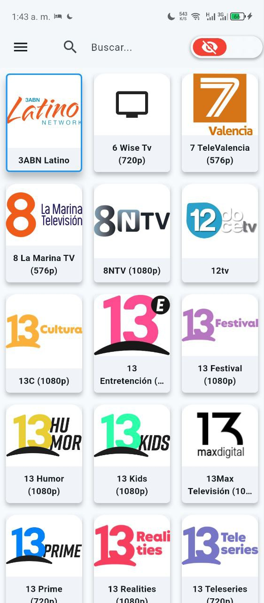
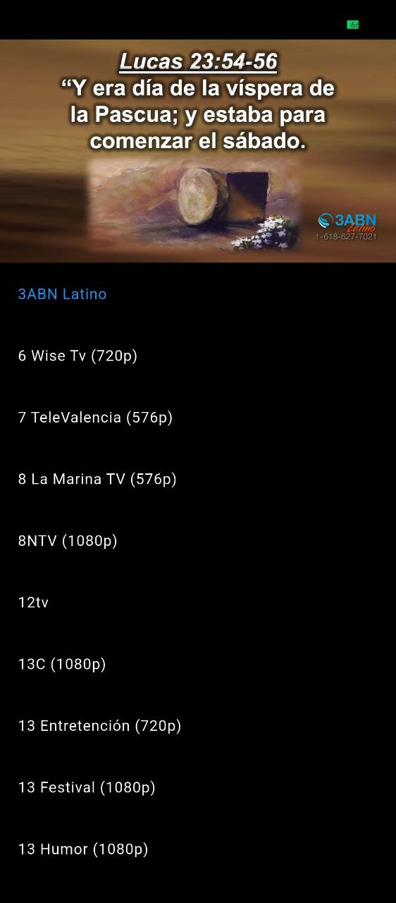

# StudioTV

Una aplicación de reproductor de IPTV desarrollada con fines educativos para demostrar cómo funciona un reproductor de este tipo. El enfoque principal es proporcionar una experiencia de reproducción de video fluida y fácil de usar.

## Capturas de Pantalla

|                     Pantalla Principal                     |                     Reproductor de Video                     |
|:----------------------------------------------------------:|:------------------------------------------------------------:|
|  |  |

## Descargo de responsabilidad

### Contenido
No alojamos, proporcionamos, archivamos, almacenamos ni distribuimos medios de ningún tipo. Esta aplicación actúa únicamente como un reproductor de video y no tiene control sobre el contenido que se transmite.

No somos responsables de la exactitud, el cumplimiento, los derechos de autor, la legalidad, la decencia o cualquier otro aspecto del contenido transmitido desde sus fuentes. Si tiene algún problema legal, póngase en contacto con los propietarios de los archivos multimedia o los proveedores de alojamiento correspondientes.

### Privacidad
No recopilamos datos de ningún tipo. La aplicación no se conecta con servidores ni servicios externos, más allá de las propias fuentes de IPTV que el usuario decida utilizar.

### Distribución y Fuentes
La distribución de esta aplicación es totalmente abierta y no se cobra por ella. Es una muestra del trabajo que puedo realizar como desarrollador.

Las fuentes de las que se obtuvieron las listas de canales provienen de [iptv-org](https://github.com/iptv-org) y otras fuentes públicas.

## Sobre el autor

Soy un desarrollador de software con 6 años de experiencia en el ciclo de vida completo del desarrollo. Especialista en la arquitectura de sistemas complejos y plataformas SaaS, con dominio experto en ecosistemas como Laravel, Vue.js y PostgreSQL. Con un fuerte enfoque en la creación de APIs escalables (REST/GraphQL) y optimización de rendimiento, tengo capacidad demostrada para integrar tecnologías emergentes (Go, Python, Web3) en soluciones robustas y orientadas a resultados.

Puede ver más de mi trabajo en mi perfil de GitHub:
[https://github.com/nelsonp17](https://github.com/nelsonp17)

## Tecnologías

- **Lenguajes:** JavaScript, Node.js, TypeScript, Python, Go, Java, Dart, PHP, C/C++
- **Frontend:** Tailwind CSS, Material UI, Bootstrap
- **Backend:** GraphQL, SOAP
- **Frameworks:** Laravel, Django, Express, Flutter, Vue.js, React, Svelte
- **Bases de datos:** PostgreSQL, Redis, MySQL, SQLite
- **DevOps/Tools:** Docker, CI/CD, Git, GitLab, Supabase, Appwrite, Websocket, Socket.IO

## Características

- **Selección de Pistas de Audio:** Permite a los usuarios elegir entre las pistas de audio disponibles para una mejor experiencia de visualización.
- **Control de Volumen:** Control deslizante para ajustar el volumen del audio directamente desde el reproductor.
- **Autoscroll en la Lista de Canales:** La lista de canales se desplazará automáticamente para mostrar el canal que se está reproduciendo actualmente, mejorando la navegación en listas largas.